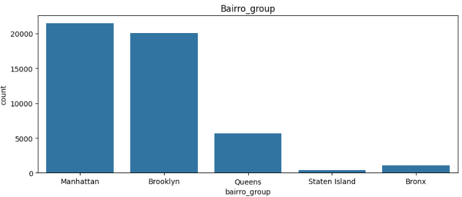

# [Rent Price per Night Prediction](https://rentpredapp.azurewebsites.net/)


## Dataset
The dataset for this project was given by Incidium, and is about advertisements from New York City on a rental platform.
It consists of 48.894 rows with 16 columns:

- **id**: Acts as a unique key for each ad in the app data
- **nome**: Represents the name of the ad
- **host_id**: Represents the id of the user who hosted the ad
- **host_name**: Contains the name of the user who hosted the ad
- **bairro_group**: Contains the name of the area where the ad is located
- **bairro**: Contains the name of the neighborhood where the ad is located
- **latitude**: Contains the latitude of the location
- **longitude** Contains the longitude of the location
- **room_type**: Contains the type of space for each ad
- **price**: Contains the price per night in dollars listed by the host
- **minimo_noites**: Contains the minimum number of nights that the user must book
- **numero_de_reviews**: Contains the number of reviews given to each listing
- **ultima_review**: Contains the date of the last review given to the listing
- **reviews_por_mes**: Contains the number of reviews provided per month
- **calculado_host_listings_count**: Contains the number of listings per host
- **disponibilidade_365**: Contains the number of days the listing is available for booking

## Objectives
The main objective of this project is:

**To develop a price prediction model from the offered dataset and put it on production**

To achieve this objective, it was further broken down into the following technical sub-objectives:

1. To perform in-depth exploratory data analysis of the dataset
2. To engineer new predictive features from the available features
3. To develop a supervised model to predict the price
4. To put the model in production with a pkl file

## Main Insights
From the exploratory data analysis, these were the main points that stood out:
- Excluding the coordinates columns, all others have a heavily positively skewed distribution, with mode < median < mean
- `bairro_group` shows that Manhattan and Brooklyn are by far the most popular locations, with approximately 40k ads in these two neighborhood groups



- `room_type` is dominated by the categories entire home/apt and private room, which is understandable


- `latitude` and `longitude` showed an excellent behavior in relation to price when sorted by area. It's clear that the neighborhoods located more in the center of the values of both columns tend to be more expensive, and the ones located at the extremes tends to be the cheapest


- `numero_de_reviews` can be a little misleading. The majority of ads have 0 reviews, but the graph shows that the higher the number of reviews, the lower the max price that it's possible to find (in general). This can be attributed by different reasons, for example, ads with a lot of reviews can indicate that the place has a high rate of booking, which means that the host can easily find someone to book the ad and is a constant form of income, so the host knows that to remain competitive, the price needs to decrease. For the ads with no reviews, it can be newer ads where the host doesn't know the price that attracts the most attention, so the price ranges from the minimal to the max. `reviews_por_mes` follows the same behavior as `numero_de_reviews`


- The column `minimo_noites` does have an impact on price with a non-linear relation, but because of the outliers values that don't follow this relation, it may not have a very big impact on the model. Also, for private rooms and shared rooms, we can clearly see a non-linear relation to the price, and for entire home/apt, the relation is visible, with a few points being outliers


- `disponibilidade_365` didn't show an impact on price during all steps of the EDA, and was dropped.

## Engineered Features and Data Distribution
From the knowledge gained during the EDA, the following feature was created:
- `distance_to_city_center`: This feature was created using the Haversine formula to calculate the distance, in kilometers, from the latitude/longitude of the row to the approximate coordinates of New York City's center. With it, the correlation matrix was plotted using the **spearman** method to handle the outliers and non-linear relations, and the new feature showed a good correlation to `price`


Since the EDA showed that a lot of numerical features had very highly positive skewed distributions, log and cubic transformations were tested on each of these columns, with a plot of their original distribution and the new ones after these transformations were applied. Also, a boxplot of the transformed feature was made to verify if the number of outliers was reduced or even if they were gone.
- `minimo_noites` had an original skewness of 11.63. The best transformation was the log one, reducing the skewness to 1.47, with a small decrease in the number of outliers
- `numero_de_reviews` had an original skewness of 3.68. The best transformation was the log one, reducing the skewness to 0.36, with all outliers gone
- `reviews_por_mes` had an original skewness of 3.3. The best transformation was the cubic one, reducing the skewness to 0.19, with a reduced number of outliers
- `calculado_host_listings_count` had an original skewness of 7.92. The best transformation was the log one, reducing the skewness to 3.28, but with a lot of outliers
- `distance_to_city_center` had an original skewness of 1.11. The best transformation was the cubic one, reducing the skewness to -0.12, with a small decrease in the number of outliers

Since `latitude` and `longitude` were not transformed (already had skewness very close to 0), all data was scaled using the Robust Scaler, to better handle the outliers, after the columns were transformed.

## Models
### Model Performance
For the modeling phase, four models will be used: **Ridge**, **Lasso**, **Random Forest** and **Gradient Boosting**. These models were chosen because of the non-linear relationship between the majority of the numerical columns and the target `price`, so using Linear Regression wouldn't make any sense in this case. To train the models, a repo in DagsHub was used, along with MLflow to keep track of all information about the models.
After the models were trained and tested, they were evaluated in terms of the metrics MAE and RMSE, to see the error of the models in the same unit as the prices, and R² to see how much of the variability of the data the model can explain, along with visualization of the residuals. Also, the top 5 most important features of each model were plotted in relation to the increase in MAE, to check if any transformation, or if the feature created, was successful or not.


Looking only at the metrics, the Random Forest model was the best one, despite the poor performance of all models

### Residual Analysis


All models had a very similar residuals behavior. No model had autocorrelated residuals, indicating that the errors of the models are independent of each other, which can be considered a good thing, since this tends to show that the model has captured the pattern in the data, with only noise in the residuals.
Despite no autocorrelation, no model was able to have residuals with a normal distribution, indicating that no model is capturing the full variability of the data. With a combination of non-normal residuals and low R² scores, is clear that no model was able to capture all non-linear relations between the data, and they are not ideal models, statistically speaking.

### Model Explainability


The ensemble models have the coordinates features as the most important ones, with the categories of `room_type` closing the list. All models have the created feature `distance_to_city_center` in their top 5 most important features, this means that all models rely on the correct values of this feature to make predictions. When permutation is applied to this feature, the impact on **MAE** is very low, making this feature very important

## Model Selection
All models had pretty similar results, with the ensemble ones having a way lower error. No model was considered ideal by the residual analysis, since there were no normally distributed residuals, which, combined with low R² scores, shows that no model was able to handle all non-linear relations between the data, nor was it able to capture the full variability of the data.
When looking at features importance, the engineered feature `distance_to_city_center` was the only one that appeared in the top 5 most important features of all models, rendering the feature engineering efforts a success
Despite no model being considered ideal and the low R² scores, the best model in terms of metrics was the **Random Forest** one, with the lower **MAE** and **RSME**, and highest **R²**
These are the model parameters:
```json
{
    criterion: "absolute_error",
    max_depth: 	20,
    max_features: "sqrt",
    n_estimators: 100,
    random_state: 42
}
```

## App Usage

The easiest way to use the app is by accessing this link: <https://rentpredapp.azurewebsites.net/>

A prediction of the following data would be **$221.92**:

```json
{'id': 2595,
 'nome': 'Skylit Midtown Castle',
 'host_id': 2845,
 'host_name': 'Jennifer',
 'bairro_group': 'Manhattan',
 'bairro': 'Midtown',
 'latitude': 40.75362,
 'longitude': -73.98377,
 'room_type': 'Entire home/apt',
 'price': 225,
 'minimo_noites': 1,
 'numero_de_reviews': 45,
 'ultima_review': '2019-05-21',
 'reviews_por_mes': 0.38,
 'calculado_host_listings_count': 2,
 'disponibilidade_365': 355
}
```

However, since the deployment was made with the free plan from Azure, which only gives 60min of usage per day, the other way is through a Docker image or running with uvicorn. Here is a step by step guide on how to create and run this image and how to run the app locally through uvicorn:

### Docker Image
### Step 1: Build Docker Image

The easiest way to build and run a docker image is with Docker Desktop. It can be downloaded [here](https://www.docker.com/products/docker-desktop/).
Clone the repository and go to the folder with the Dockerfile. Then, run the following command to build the image:

```shell
docker build -t rent_pred:latest .
```

To check if the image was created successfully, run `docker images` in your CLI and you should see `rent_pred` listed.

### Step 2: Run Docker Image

In the same CLI, run the following command to run the image:

```shell
docker run -p 80:80 rent_pred:latest
```

You should see something like this:

```shell
INFO:     Started server process [1]
INFO:     Waiting for application startup.
INFO:     Application startup complete.
INFO:     Uvicorn running on http://0.0.0.0:80 (Press CTRL+C to quit)
```

Open a web browser page and type `localhost` in the search bar. The app should load and be ready for use. Use the datasets in the folder `Datasets for app usage` to test the `Predict with Dataset` function, or create your dataset based on the original data. Or, explore the `Predict with Manual Data` function, to manually input a row of data for the model to predict.

## Running locally trough uvicorn (this assumes that you have python installed)
### Step 1: Copy artifacts folder to app folder

Clone or download this repository, then go to the main folder where the folders **artifact** and **app** are.
Copy the **artifacts** folder and past it inside the **app** folder.

### Step 2: Install libraries

Once you have copied and pasted all the necessary folders to the **app** folder, go back to the main folder of the project (where requirements.txt is).
Open a command prompt in this folder and run this command:

```shell
pip install -r requirements.txt
```

### Step 3: Run the app

On the same command prompt, run the following command to run the app:

```shell
uvicorn app.main:app --reload
```

You should see something like this:

```shell
INFO:     Uvicorn running on http://127.0.0.1:8000 (Press CTRL+C to quit)
INFO:     Started reloader process [5112] using StatReload
INFO:     Started server process [10296]
INFO:     Waiting for application startup.
INFO:     Application startup complete.
```

Copy the adress that the app is running, in this case http://127.0.0.1:8000, and open it on a web browser. The app should load and be ready for use. Use the datasets in the folder `Datasets for app usage` to test the `Predict with Dataset` function, or create your dataset based on the original data. Or, explore the `Predict with Manual Data` function, to manually input a row of data for the model to predict.
